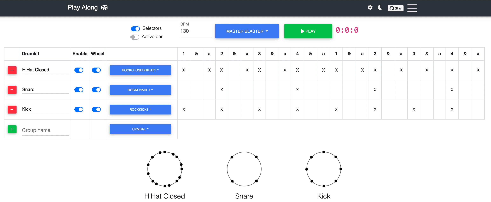

Play Along | Drums <g-emoji class="g-emoji" alias="drum" fallback-src="https://github.githubassets.com/images/icons/emoji/unicode/1f941.png">🥁</g-emoji>
==

Learn to play drums with this collection of popular grooves.

Grooves can be played and will animate in tabular and wheel forms.

The goal is to gather a huge collection of popular grooves, so please feel free to contribute extra grooves or provide corrections to existing ones [here](https://github.com/bobbyrne01/play-along/issues).

#### Attributions

Audio samples from [MusicRadar](https://www.musicradar.com).
